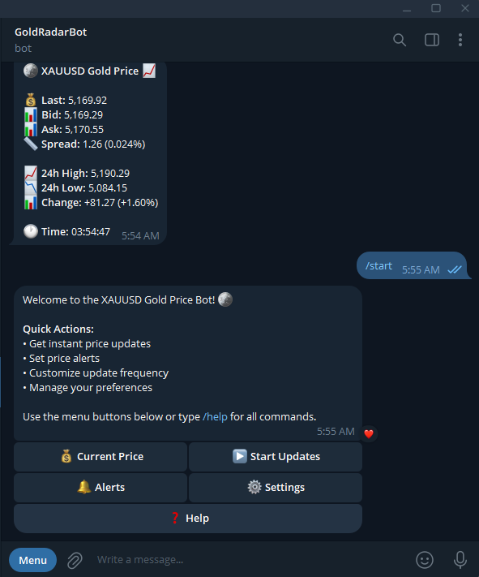
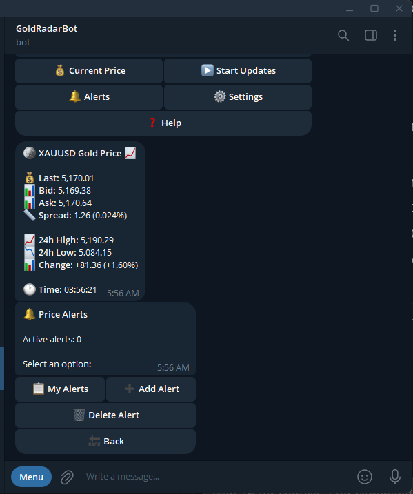
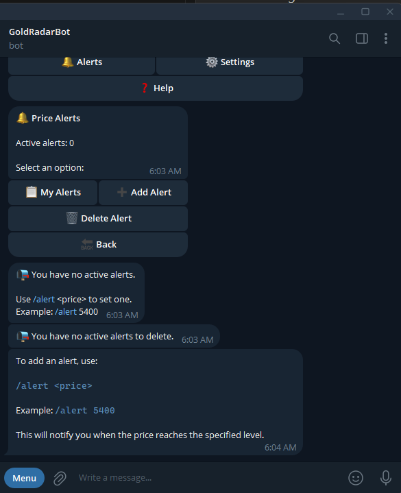
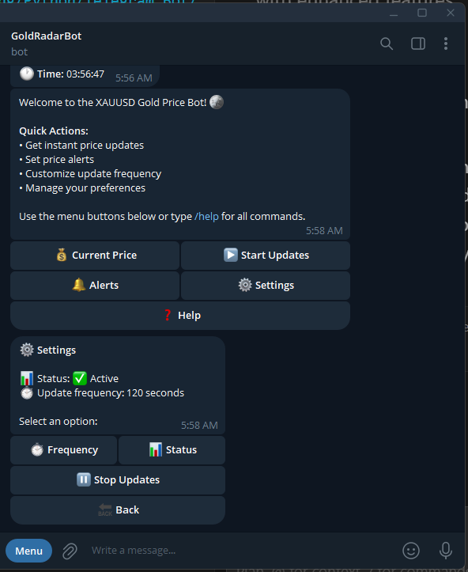
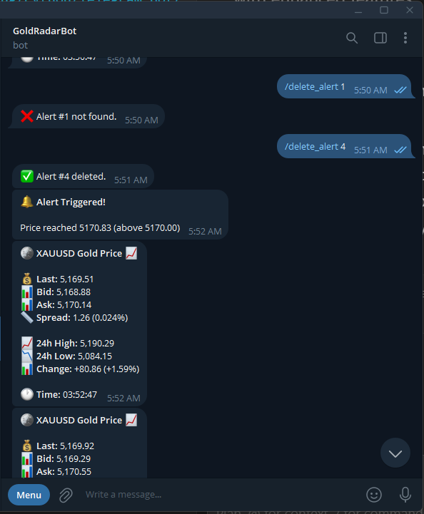

# Telegram Gold Price Bot

A Telegram bot that provides real-time XAUUSD (Gold) price updates via WebSocket connection. The bot connects to investing.com webSocket streaming service and sends continuous price updates to subscribed users.

## Features

- 🔄 Real-time XAUUSD price updates via WebSocket
- 📱 Interactive Telegram bot interface
- 🔁 Automatic WebSocket reconnection
- ⚙️ Configurable update frequency
- 🛡️ Error handling and connection management
- 🔔 Price alerts with automatic notifications
- 📊 Enhanced price display with bid/ask, spread, and 24h statistics
- 🎛️ Expandable menu system with submenus

## Screenshots

### Main Menu
  
*The bot's main interface showing the welcome message and interactive menu buttons for quick access to all features.*

### Enhanced Price Display
  
*Detailed real-time gold price information including Last, Bid, Ask, Spread, 24h High/Low, Change percentage, and timestamp.*

### Price Alerts Menu
  
*The alerts submenu allowing users to view, add, and delete price alerts with an intuitive interface.*

### Settings Menu
  
*Settings interface showing current status (Active/Inactive) and update frequency, with options to customize frequency and view status.*

### Alert Trigger
  
*Example of an alert being triggered when the price reaches the specified threshold, with confirmation message and updated price display.*

## Prerequisites

- Python 3.7+
- Telegram Bot Token (get it from [@BotFather](https://t.me/BotFather))
- Internet connection for WebSocket and Telegram API

## Installation

1. Clone the repository:
```bash
git clone https://github.com/mohamedsaid5/telegram-gold-price-bot.git
cd telegram-gold-price-bot
```

2. Install dependencies:
```bash
pip install -r requirements.txt
```

3. Configure the bot:
   - Copy `config.json.example` to `config.json`
   - Add your Telegram Bot API token to `config.json`

```json
{
    "API_TOKEN": "YOUR_TELEGRAM_BOT_TOKEN_HERE",
    "USER_ID1": "optional_user_id_1",
    "USER_ID2": "optional_user_id_2"
}
```

## Usage

Run the bot:
```bash
python telegram_gold_price_bot.py
```

### Bot Commands

- `/start` - Start the bot and get interactive menu
- Click "Get XAUUSD Price" to start receiving price updates
- Click "End" to stop receiving updates

## Configuration

- `update_frequency`: Update interval in seconds (default: 60)
- `API_TOKEN`: Your Telegram Bot API token
- WebSocket URL: Configured for investing.com webSocket XAUUSD streaming

## Project Structure

```
telegram-gold-price-bot/
├── telegram_gold_price_bot.py  # Main bot script
├── config.json                  # Configuration file (not in repo)
├── config.json.example          # Configuration template
├── requirements.txt             # Python dependencies
├── README.md                    # This file
├── .gitignore                   # Git ignore rules
└── screenshots/                 # Screenshot images
    ├── main-menu.png
    ├── enhanced-price-display.png
    ├── alerts-menu.png
    ├── settings-menu.png
    └── alert-trigger.png
```

## Dependencies

- `pyTelegramBotAPI` - Telegram Bot API wrapper
- `websocket-client` - WebSocket client library

## License

This project is open source and available under the MIT License.

## Contributing

Contributions, issues, and feature requests are welcome!

## Disclaimer

This bot is for informational purposes only. Always verify prices from official sources before making trading decisions.

**Note:** During holidays, the WebSocket connection may not return price updates as markets are typically closed. The bot will attempt to reconnect automatically when markets reopen.

## Future Feature Suggestions

**Admin Commands:** User management (ban/unban, user info), alert management (view all alerts, delete any alert), system management (restart, reload config, test WebSocket), monitoring (health checks, error logs, performance metrics), database operations (backup, export, cleanup), notifications (targeted messaging), maintenance mode, analytics, and security features.

**Multiple Currency Pairs:** Support for tracking multiple currency pairs by storing price data in dictionaries keyed by pair_id, parsing pair IDs from WebSocket messages, creating pair name mappings, allowing users to subscribe to multiple pairs, updating alerts system to include pair_id, and implementing pair management commands. Implementation phases: basic multi-pair support → user subscriptions → UI management → database persistence → advanced features.